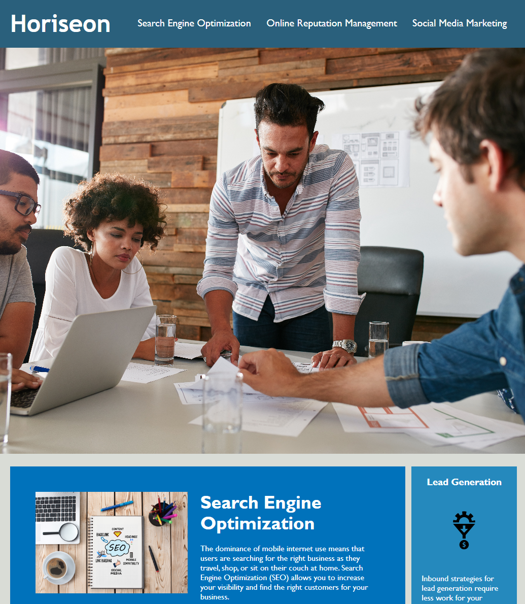

# Horiseon

## Description

This is a website for a digital marketing agency. I was tasked to refactor the code to make it more accessible.

The code for the website did work. However, there were repeating lines of code in the HTML and CSS files. 

To make the codes easier to read, I added classes and id to distinguish for the CSS elements and deleted repeated codes in the CSS files. I also included alt attribute to help meet accessibility standards.

One of the challenges I've faced is checking the HTML structure. The code had missing tags, which affected the CSS styling for classes. Once I went back and looked at the elements, I was able to fix it and have the elements working again.

Here's the link to the website: https://cmdnguyen.github.io/Horiseon-Module/

## Installation

N/A

## Usage

The website is used to show what I have learned so far as a bootcamp student. The best way to view it is on Google Chrome and you can inspect the elements in Chrome DevTools.

## Credits

Starter code: github.com/coding-boot-camp/urban-octo-telegram

## License

MIT License

Copyright (c) 2023 Catherine Nguyen

Permission is hereby granted, free of charge, to any person obtaining a copy of this software and associated documentation files (the "Software"), to deal in the Software without restriction, including without limitation the rights to use, copy, modify, merge, publish, distribute, sublicense, and/or sell copies of the Software, and to permit persons to whom the Software is furnished to do so, subject to the following conditions:

The above copyright notice and this permission notice shall be included in all copies or substantial portions of the Software.

THE SOFTWARE IS PROVIDED "AS IS", WITHOUT WARRANTY OF ANY KIND, EXPRESS OR IMPLIED, INCLUDING BUT NOT LIMITED TO THE WARRANTIES OF MERCHANTABILITY, FITNESS FOR A PARTICULAR PURPOSE AND NONINFRINGEMENT. IN NO EVENT SHALL THE AUTHORS OR COPYRIGHT HOLDERS BE LIABLE FOR ANY CLAIM, DAMAGES OR OTHER LIABILITY, WHETHER IN AN ACTION OF CONTRACT, TORT OR OTHERWISE, ARISING FROM, OUT OF OR IN CONNECTION WITH THE SOFTWARE OR THE USE OR OTHER DEALINGS IN THE SOFTWARE.

---
